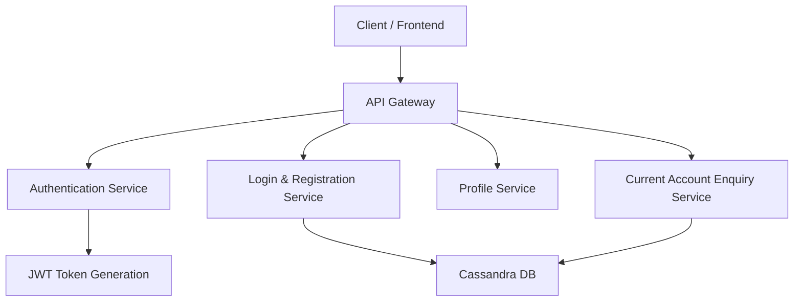

# 🏦 VYOM 2.0 – Enterprise Business Banking Platform

**Client:** Union Bank of India  
**Role:** Backend Developer  
**Domain:** Retail & Corporate Banking  
**Architecture:** Reactive Microservices Architecture  
**Deployment:** RedHat OpenShift (OCP)

---

# 📌 Project Overview

VYOM 2.0 is a large-scale, enterprise-grade Business Banking backend platform developed to support Retail and Corporate banking journeys. The system powers mission-critical operations including secure authentication, customer onboarding, profile management, and real-time current account enquiry.

The primary objective of the platform is to build a scalable, resilient, and high-performance backend infrastructure capable of handling high transaction volumes with minimal latency. The system is designed to support thousands of concurrent users while maintaining strict compliance with banking-grade security standards.

The platform follows a Reactive Microservices Architecture to ensure:

- Non-blocking asynchronous request handling  
- High concurrency support  
- Improved system throughput  
- Low response latency  
- Fault isolation between services  
- Horizontal scalability in cloud-native environments  

Each banking capability (Login & Registration, Profile, Account Enquiry, etc.) is implemented as an independent microservice, enabling modular deployment, easier maintenance, and better fault tolerance.

The backend integrates distributed and relational databases:
- Cassandra for high-volume transactional workloads

Security is enforced using Spring Security with JWT-based authentication and AES encryption for sensitive information.

The system is containerized and deployed on RedHat OpenShift to ensure reliability, scalability, and cloud-native readiness.

---

# 🏗 High-Level Architecture

## System Flow

1. Client (Web/Mobile) sends request.
2. API Gateway routes request to appropriate microservice.
3. JWT authentication validates access.
4. Business logic executes using CQRS pattern.
5. Reactive processing via Spring WebFlux.
6. Data is persisted/retrieved from Cassandra or PostgreSQL.
7. Standardized response returned asynchronously.

---

## Architecture Diagram



---

# 🛠 Tech Stack

## Backend
- Java 17
- Spring Boot
- Spring WebFlux
- Microservices Architecture
- CQRS Design Pattern

## Database
- Apache Cassandra

## Security
- Spring Security
- JWT Authentication
- AES Encryption

## Testing & Quality
- JUnit
- Mockito
- StepVerifier
- SonarQube

## DevOps & Tools
- GitLab
- Jira
- RedHat OpenShift (OCP)
- Postman

---

# 🔐 Security Implementation

- Stateless JWT-based authentication
- AES encryption for sensitive payloads
- Role-based access control
- Custom request validation filters
- Centralized global exception handling
- Secure HTTP headers configuration
- Input validation and sanitization

---

# ⚙️ Core Modules

## 1️⃣ Login & Registration Module
- Secure user authentication
- JWT token generation & validation
- Customer onboarding flow
- Password validation and encryption

## 2️⃣ Profile Management Module
- Fetch and update customer details
- Data validation and consistency checks
- Reactive processing for faster response

## 3️⃣ Current Account Enquiry Module
- Real-time balance enquiry
- Transaction data retrieval
- High-concurrency request handling

---

# ⭐ Key Responsibilities

- Designed and developed scalable REST APIs.
- Built reactive non-blocking microservices.
- Implemented CQRS for performance optimization.
- Integrated Cassandra for distributed scalability.
- Implemented centralized exception-handling framework.
- Optimized caching logic to reduce redundant calls.
- Improved payload processing and request mapping.
- Developed comprehensive unit and integration tests.
- Collaborated with QA and cross-functional teams.
- Ensured production stability under peak load.

---

# 🚀 Performance Optimization

- Achieved 20–30% improvement in API response time.
- Reduced redundant external calls by 40–50%.
- Reduced debugging effort by ~25% through standardized errors.
- Improved workflow automation by ~20%.
- Enhanced system stability under high traffic.

---

# 📊 Scalability Strategy

- Reactive non-blocking execution model
- Stateless services for load balancing
- Horizontal scaling using containerized deployment
- Cassandra distributed storage architecture
- Efficient caching layer to reduce DB load

---

# 📦 Conceptual Folder Structure

```
src/
 ├── controller/
 ├── service/
 ├── repository/
 ├── config/
 ├── security/
 ├── exception/
 ├── filter/
 └── util/
```

---

# 💡 Sample Use Cases

- Secure login with JWT token validation
- Retail and corporate customer onboarding
- Real-time current account enquiry
- Workflow-based approval journey handling
- High-concurrency transaction processing

---

# 📈 Outcome & Business Impact

- Improved API performance by 20–30%.
- Reduced redundant database/API calls by 40–50%.
- Reduced manual workflow intervention by ~20%.
- Standardized error responses across services.
- Successfully supported enterprise-scale digital banking operations.

---

# 👨‍💻 Author

Shreyash Chavan  
Backend Developer – Java & Microservices  
LinkedIn: linkedin.com/in/shreyashc023/
